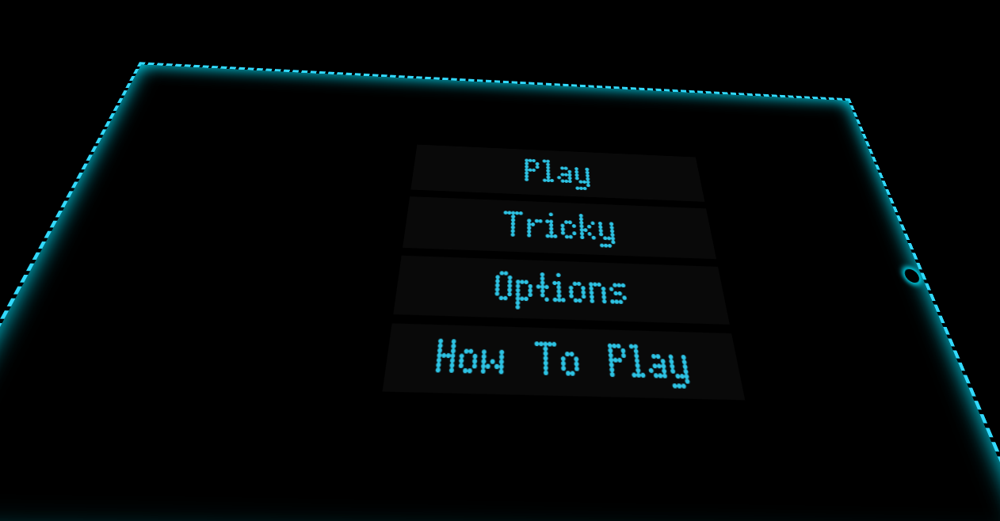

# Snaix

Play snake in your browser. Written in vanilla JavaScript with no fancy libraries or frameworks.

   

## Overview

Snaix was originally created as a Chrome App but the version here is simply a static webpage. Some of the pickups are also powerups, these include: Speed Up, Slow Down, Increase Length, and Decrease Length. Each of these has an associated color. All logic is in [page-script.js](snaix/page-script.js). The "Snake" exists as an array of HTML elements that follow each other across the canvas.

## Getting Started

### Dependencies

* Any web browser

### Playing

To play Snaix simply clone this repo and open [snaix.html](snaix/snaix.html) in your web browser.

    

